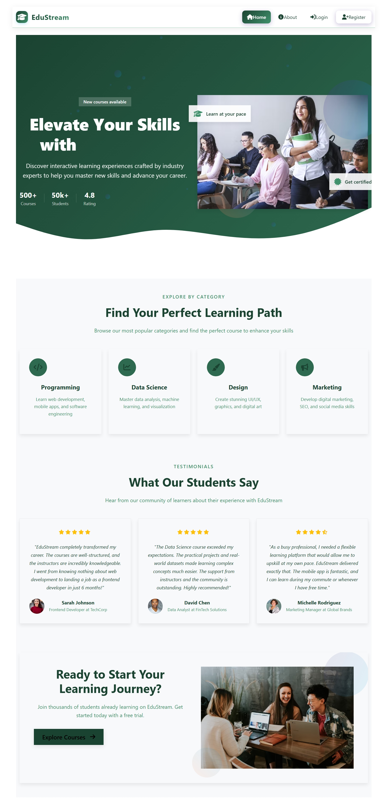
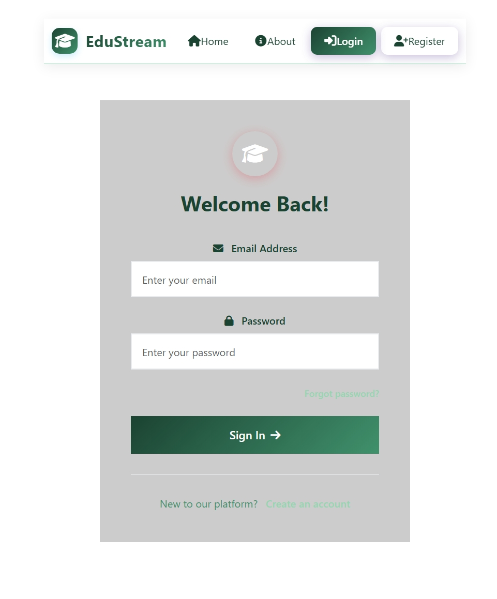
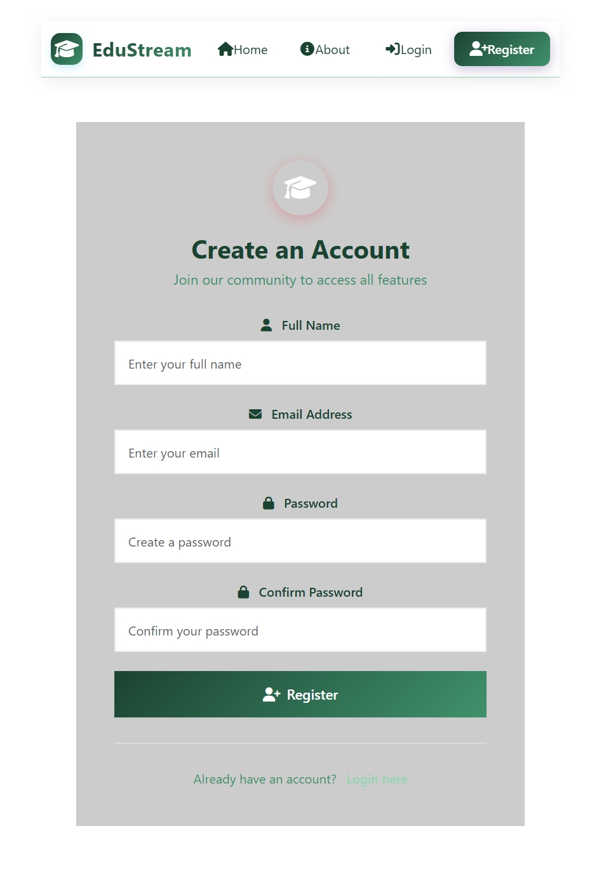
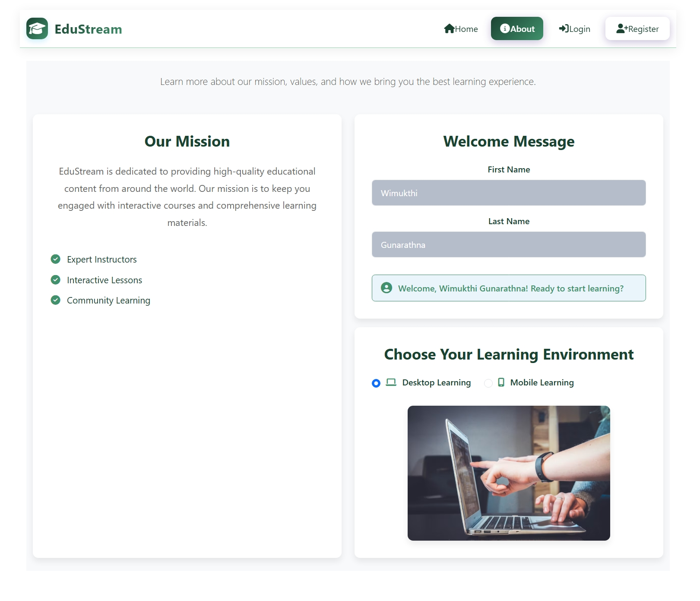

# 🎓 Course Management System

A modern course management application built with **Vue.js 3**, **TypeScript**, and **Pinia**, offering a seamless experience for learners and educators to manage courses, track learning progress, and engage with content.

---

### 📚 Core Functionality
- **Course Enrollment**: Users can browse, register, and enroll in available courses.
- **User Authentication**: Secure registration and login system.
- **Real-time Updates**: Dynamic content updates using Pinia state management.
- **Interactive UI**: Modern and responsive design with smooth transitions.

### 🧠 Course Features
- **Advanced Filtering**:
  - Categories: Programming, Design, Marketing, etc.
  - Difficulty levels: Beginner, Intermediate, Advanced
  - Search by course name or instructor
- **Course Details**:
  - Title and description  
  - Instructor name  
  - Start date and duration  
  - Learning mode (Desktop / Mobile)  
  - Progress tracking  

### 👥 User Interactions
- **Course Registration**: Users can sign up for new courses via the Register page.
- **Progress Management**: Save and resume course progress.
- **User Dashboard**: Personalized learning dashboard.
- **Welcome Message**: Greeted with a custom message after login.

---

## 🛠️ Technical Stack

| Category         | Technology                     |
|------------------|-------------------------------|
| **Frontend**     | Vue.js 3 (Composition API)     |
| **Type Safety**  | TypeScript                     |
| **State Mgmt**   | Pinia                          |
| **Styling**      | CSS3 with custom variables     |
| **Icons**        | Font Awesome                   |
| **Routing**      | Vue Router                     |
| **Storage**      | Local Storage                  |
| **Tooling**      | Vite, ESLint                   |

---

## 📱 Responsive Design

- Fully responsive layout  
- Mobile-first approach  
- Adaptive components  
- Touch-friendly interfaces  

---

## 🔒 Security Features

- Form validation  
- Protected routes  
- Secure user authentication  
- Authorization for learning environments  

---

  

### Home Page  

---
 
### Login Page  

---

### Register Page  

---

### About Page  
Includes mission statement, welcome message, and learning mode selector.  

---

